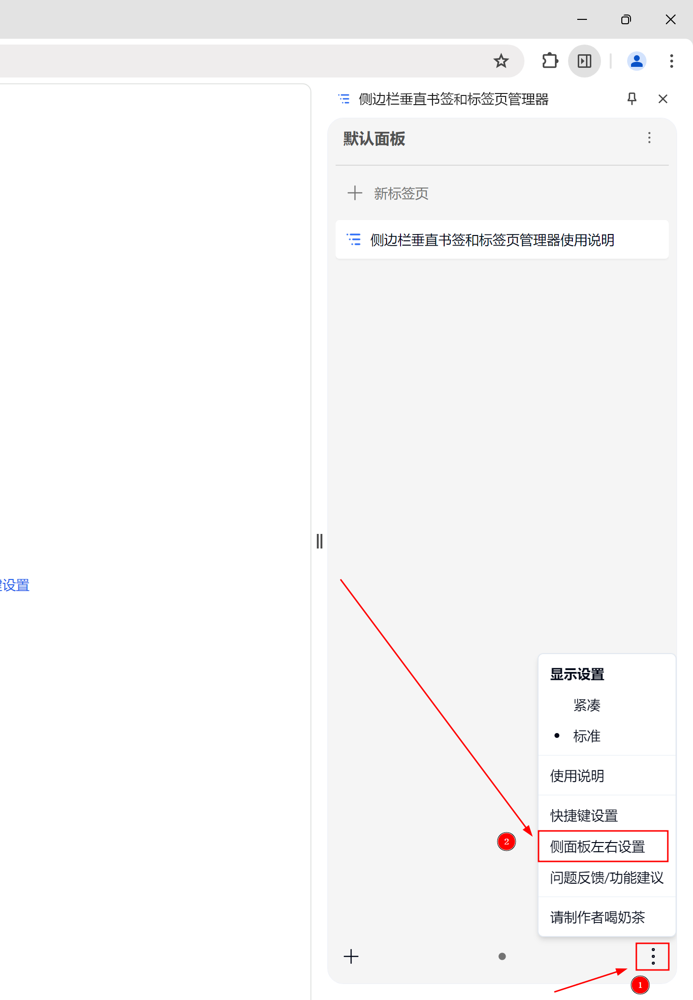
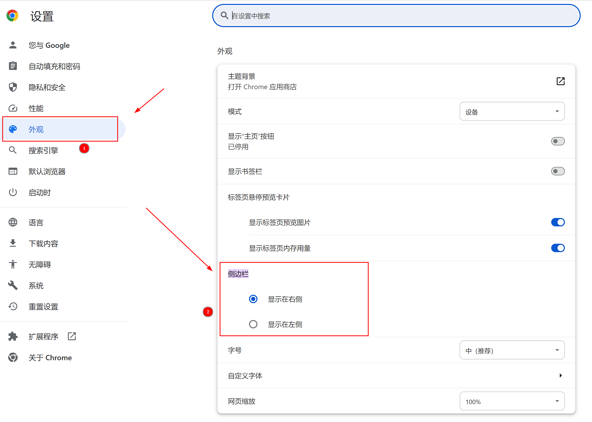
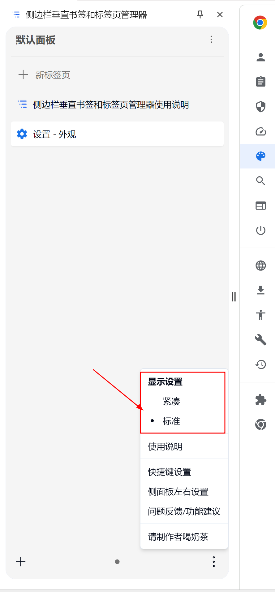
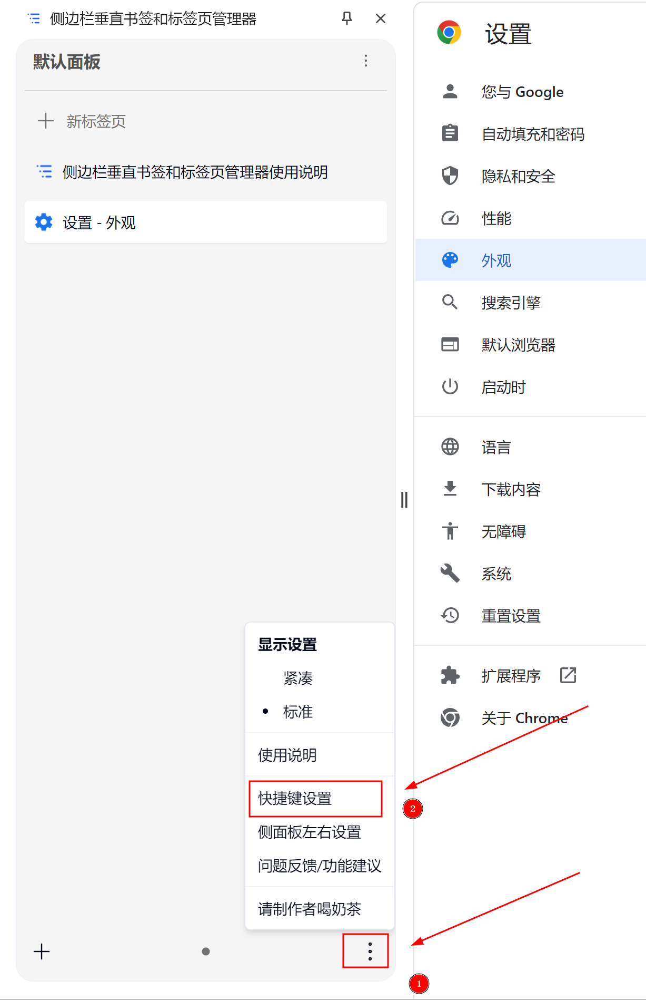
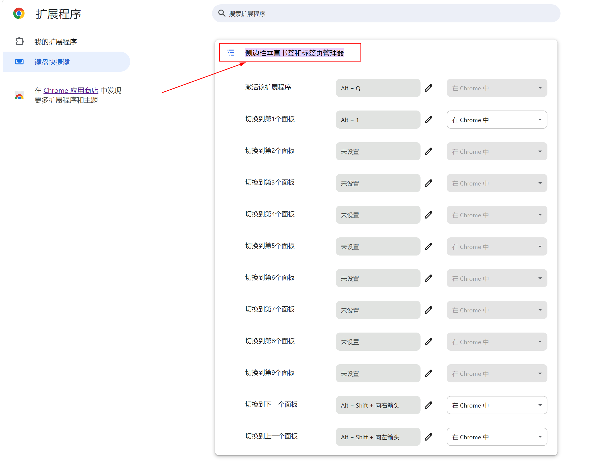

## 侧边栏位置设置

默认情况下以 Chrome 浏览器为例，侧边栏会在右边，推荐设置为左边，这样更符合大部分人的操作习惯。

### 图示操作步骤

## 显示设置

显示设置主要是用于设置侧边栏内单个标签页或书签的显示大小，有标准和紧凑两个选择，默认是标准。

### 图示操作步骤

## 快捷键设置

使用快捷键可以更方便的切换面板，有更好的体验，因为浏览器权限限制，扩展只能默认建议 4 个快捷键，所以无法直接设置好，得用户自行到扩展快捷键设置页面设置。

### 目前有的快捷键

- 打开和关闭扩展： 默认为 `Alt+Q`
- 切换到下一个面板：默认为 `Alt+Shift+Right`
- 切换到上一个面板：默认为 `Alt+Shift+Left`
- 切换到第 1 个面板：默认为 `Alt+1`
- 切换到第 2 个面板：无默认
- 切换到第 3 个面板：无默认
- 切换到第 4 个面板：无默认
- 切换到第 5 个面板：无默认
- 切换到第 6 个面板：无默认
- 切换到第 7 个面板：无默认
- 切换到第 8 个面板：无默认
- 切换到第 9 个面板：无默认

### 图示操作步骤

