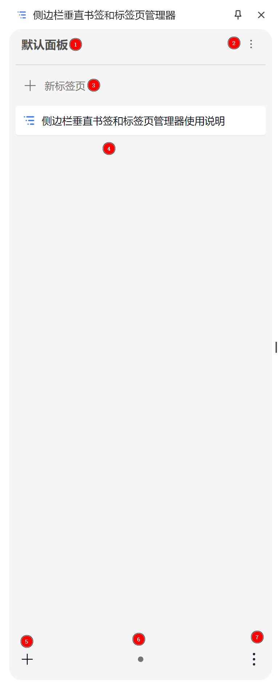
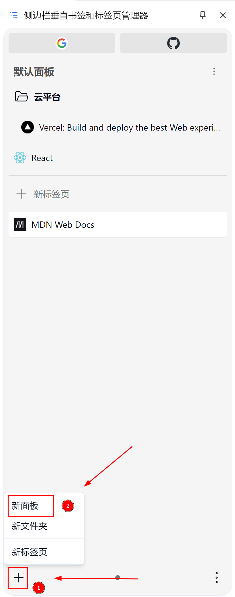
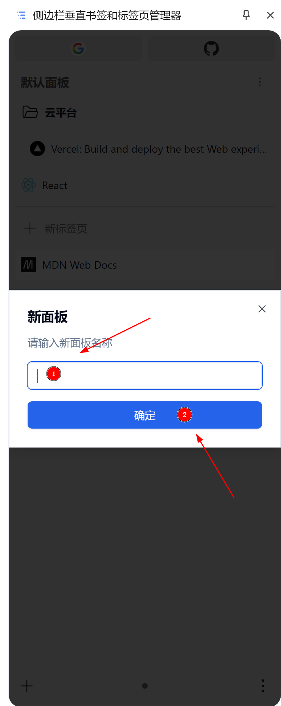
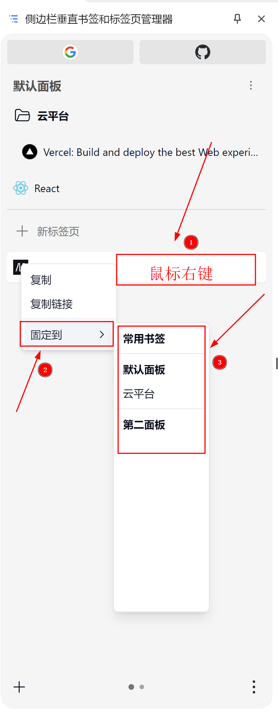

## 扩展显示

扩展并不会一开始就显示全部区域，常用书签和当前面板书签只有添加之后才会占用空间

### 初始状态

下图是刚安装本扩展的初始状态

根据图示序号分别对应：

1. 当前面板名称
2. 当前面板设置按钮
3. 打开新标签页按钮
4. 标签页显示区域
5. 添加菜单按钮（包括添加面板、书签文件夹、标签页）
6. 面板切换按钮
7. 扩展设置菜单按钮

### 固定了常用书签和普通书签

下图是固定了常用书签和普通书签且创建了书签文件夹的状态

根据图示序号分别对应

1. 常用书签显示区域
2. 当前面板书签显示区域

## 创建新面板

按照下图步骤即可创建新面板

## 固定标签页到常用书签或指定面板书签

按照下图步骤即可固定标签页到指定位置

## 移动或移除固定的常用书签或指定面板书签

右键所需操作的对象，使用菜单栏对应的选项点击即可
